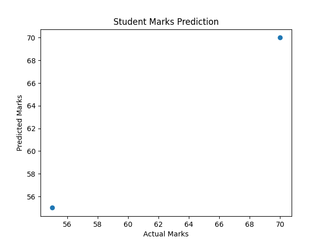

# Student Marks Prediction

This project predicts student marks based on study habits using
Machine Learning (Linear Regression).

## Features
- Predicts marks from study data
- Beginner-friendly regression model
- Visual comparison of actual vs predicted marks

## Tech Stack
- Python
- Pandas
- Scikit-learn
- Matplotlib

## How to Run
1. Install requirements
2. Run `python main.py`

## Output

